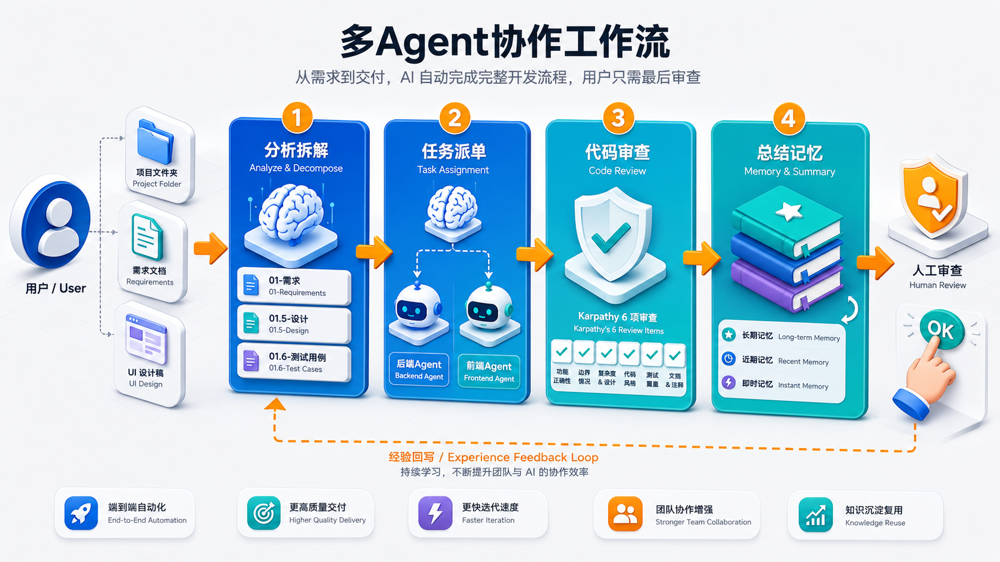

# ai-agents-kit — 多Agent协作工作流初始化脚手架

**作者**: ailu &lt;ailu5949@gmail.com&gt;
**License**: [MIT](LICENSE)
**English**: [README.en.md](README.en.md)



一键给你的项目装上一套 **AI 协作 harness**:主 Claude 当总指挥(拆需求 / 写编码合同 / 审查 / 修复 / 复盘),后台 2 个编码 agent(Codex CLI 或 Claude CLI)分别在 backend / frontend 写代码,你只在终点做人工审查。

> 一句话:让"丢给 AI 一个项目 / 一份需求 / 一套 UI 方案,它自己跑完到可审查产物"这件事工程化、可复用、可观测。

---

## 谁适合用

| 你是… | 这个工具帮你解决什么 |
|---|---|
| **接手老代码库的人**(刚加入项目 / 接前同事屎山 / 维护旧系统) | 主 Claude 帮你读懂代码 + 总结架构,加功能 / 修 bug 时自动避开历史踩坑(memory bugs.md) |
| **个人开发者 / 小团队**(没有完整测试 + CR 流程,但又怕 AI 写出垃圾码) | 强制 Karpathy 6 项审查 + 真打跑测试 + lint + curl smoke,AI 不能"假装完成" |
| **手里有需求文档 / Figma / UI 方案的人**(产品经理 / 独立开发者) | 把需求 / 静态稿丢给主 Claude → 自动拆 01-需求.md → 派编码 agent 实现 → 审查 → 复盘,你只点 OK |
| **重度 Claude Code / Codex CLI 用户**(打 prompt 打到手酸) | 工程化派单合同(02/03)代替反复打 prompt;状态写文件系统,跨会话 / 跨终端 / 关掉 IDE 都能恢复 |
| **想攒可复用经验的人**(跨项目踩同样坑很烦) | 三层 memory(`global/patterns,bugs` + `projects/context` + `ideas/product-ideas`)自动回写,P2 项目直接复用 P1 教训 |
| **想用多家 AI CLI 的人**(codex 配额用完想切 claude) | Provider 抽象 + `/retry-other-provider` 一键切对家,handover.md 接续点不重做 |

**不适合**:已经有完整 CI / CR / 自动化测试体系 + 不需要 AI 编码的成熟团队(这套工具的价值在"代替 CR / 替代测试纪律",成熟团队已经有更好的)。

---

## 典型场景

### 1. 接手老项目 + 加新功能 / 修 bug

```bash
cd /path/to/legacy-project           # 老代码库,你不熟悉
git init                              # 没 git 的话先初始化
bash /c/Users/mi/ai-agents-kit/install.sh --yes
claude .                              # 在 Claude Code 里跟主 Claude 说需求
```

主 Claude 启动时**自动扫**:`memory/projects/context.md`(本项目独有上下文)+ `memory/global/bugs.md`(跨项目踩坑) → 读完才动手,不会一上来就翻新坑。

### 2. 新项目从零(需求文档 → 完整功能)

把一份 markdown 需求(或 Figma / UI 静态稿)丢给主 Claude:

```
你: 实现 GET /api/stocks 接口返回热门股票,前端 /stocks 页面用表格展示
主 Claude: 拆 01-需求.md → (可选)01.5-设计.md + 01.6-测试用例.md
           → 02-后端编码.md / 03-前端编码.md → 派后端 → 审查 → 派前端 → 联调 → 复盘
你: 全程只在 ready-for-human 节点点 OK
```

详见下方"一个完整示例"。

### 3. UI 高保真稿落地

给 Figma 链接 / HTML 静态稿 / 设计 token,主 Claude 写 03-前端编码.md 派单合同(命名空间冻结 / 字体 CDN 镜像 / 禁用 Google Fonts 等约束),编码 agent 复刻还原。审查阶段静态自检 grep 命令 + Lane F12 验收。

### 4. 长任务你想关 IDE 去吃饭

```bash
bash .aiagents/bin/agentctl.sh up                # 起后台 watcher
# 派完任务后关掉 Claude Code,去吃饭
# 编码 agent 完成时桌面 toast: [your-project] backend done — 回到 Claude Code 审查
```

### 5. 切模型 / 切会话 / 切电脑

`/handover` 生成 `00-交接.md` 快照 → 新会话 / 新模型读快照 + memory 秒接管。详见"升级 / 迁移"。

### 6. 跨项目复用经验

P1 项目跑完 → `/retrospective` 自动整理"做对了什么 / 踩了什么新坑" → 回写到 `memory/global/{patterns,bugs}.md` → P2 项目 install 后**自动继承**这些经验,新会话主 Claude 启动必读。

---

## 解决什么问题

| 痛点 | 解决方式 |
|---|---|
| 单个 Claude 跑复杂任务容易丢上下文 / 偷工 / "假装完成" | 拆成 **总指挥 + 编码 agent**:主 Claude 不直接写业务码(`settings.json` `permissions.deny` 硬约束),只产合同 + 审查 |
| Claude 自报"做完了"难分辨真假 | **Karpathy 6 项审查**(A 执行 / B Think / C Simplicity / D Surgical / E Goal / F Sanity)+ **Pre-Human Decision Gate**(主 Claude 必须真打跑测试 + curl smoke + lint 全过才让你拍板) |
| 长任务希望关掉 IDE / 切别的项目时仍能跑 | watcher 后台常驻,状态写文件系统(`state/current.json` + `events.jsonl`),跨会话可恢复 |
| 编码 agent 完成 / 失败时主 Claude 不在线 → 没人知道 | **Stop hook + Windows 桌面 toast** 双层通知,Lane 离线也能收到提醒 |
| 派单后没法看到副 agent 实时在动什么 | `agentctl.sh logs <agent>` 实时跟 pretty 流(文本 / 工具调用 / result),不刷原始 JSON |
| 副 agent 跑一半 token 不够 / sandbox 异常 / 限流 | `/retry-other-provider <agent>` 切对家(codex ↔ claude),handover.md 把接续点传给新 provider,不重做 |
| 跨项目跨会话经验丢失 | 三层 **memory**(`global/{patterns,bugs}.md` / `projects/context.md` / `ideas/product-ideas.md`),任务前必读 + 复盘后回写 |
| 多 bash 窗口 / Cursor 多面板协作时,各窗口看不到对方状态 | 所有状态 / 事件 / 心跳写进 `.aiagents/state/` + `runtime/`,任意终端 `agentctl status` 随时看 |

---

## 工作流(它怎么帮你)

```
你给:    项目目录 / 需求文档 / UI 方案
         │
         ▼
1. 分析拆解 (主 Claude)
   ├─ 读 memory 4 份(避免重蹈历史坑)
   ├─ 产 01-需求.md (验收标准)
   ├─ 可选: 产 01.5-设计.md  (架构/数据模型/接口契约/状态机/关键决策)
   └─ 可选: 产 01.6-测试用例.md (TC-ID + Given/When/Then + 反向对齐验收)
         │
         ▼
2. 任务派单 (主 Claude → 编码 agent)
   ├─ 产 02-后端编码.md (派单合同)
   ├─ 产 03-前端编码.md
   └─ /dispatch-backend → watcher → agent-runner → codex/claude CLI 写代码 + 测试 + commit
         │
         ▼
3. 代码审查 (主 Claude, 强制真打)
   ├─ Karpathy 6 项 (A 执行 / B Think / C Simplicity / D Surgical / E Goal / F Sanity)
   ├─ Pre-Human Decision Gate (跑 pytest + ruff + curl smoke + 真 E2E, 任一失败必修)
   ├─ 失败 → 自动产 04-修复.md → /bugfix-backend → 重做 (最多 3 轮)
   └─ 通过 → state=ready-for-human
         │
         ▼
4. 写报告 + 汇总记忆 (主 Claude)
   ├─ reviews/{backend,frontend}-review.md (每轮审查留档)
   ├─ retrospectives/<date>-retro.md (整轮复盘)
   └─ 回写 memory/{global/patterns,global/bugs,projects/context,ideas/product-ideas}.md
         │
         ▼
你做:    最后的人工审查 (点 OK 收下 / 打回让 AI 重做)
         离线时桌面 toast 通知, 不用守着
```

**未来扩展(优先级低)**:第 5 步自动化部署 — 跑通审查后自动 build / deploy / smoke,当前不做,Lane 手动 deploy。

---

## 安装

### Bash(Linux / WSL / macOS / Git Bash)

```bash
cd /d/dev/ai/workspace/your-project
git init                                                  # install.sh 用 git rev-parse 定位项目根
bash /c/Users/mi/ai-agents-kit/install.sh                 # 交互式
bash /c/Users/mi/ai-agents-kit/install.sh --yes           # 非交互(默认轻量 Python + React)
```

### PowerShell(Windows 原生)

```powershell
cd D:\dev\ai\workspace\your-project
git init
pwsh C:\Users\mi\ai-agents-kit\install.ps1
pwsh C:\Users\mi\ai-agents-kit\install.ps1 -BackendDir backend -Yes
```

### 起手栈预设(`--stack` / `-Stack`)

| 预设 | 后端 | 前端 |
|---|---|---|
| `python-light`(**默认**) | FastAPI + SQLAlchemy + pytest + ruff | Vite + React |
| `python-poetry` | 同上,用 poetry 管包 | 同上 |
| `go` | Go + Gin | Vite + React |
| `node-fullstack` | Fastify | Next.js |
| `java-enterprise` | Spring Boot 3 + Maven | Vite + React |
| `java-gradle` | Spring Boot 3 + Gradle | Vite + React |

```bash
bash install.sh --yes --stack python-light       # 中小项目 / 个人项目首选
bash install.sh --yes --stack java-enterprise    # 重型企业
```

### 可选开关(默认全关,按需启用)

主 Claude 默认只产 `01-需求.md` + `02/03-编码.md` + 自查审查。复杂项目可启用三个可选项:

| Flag | 作用 | 产物 / 行为 |
|---|---|---|
| `--with-design-doc` | 设计文档阶段 | `specs/01.5-设计.md`:架构图 / 数据模型 / 接口契约 / 状态机 / 关键决策 |
| `--with-test-cases` | 测试用例阶段 | `specs/01.6-测试用例.md`:用例表(TC-ID / Given/When/Then)+ 边界条件 + 反向对齐验收点 |
| `--with-adversarial-review` | **对抗性审查** | 真打验证后,用**异构 provider**(默认 codex)独立"找茬",防主 Claude 同体审查盲区 |

```bash
bash install.sh --yes --with-design-doc                          # 启用设计文档
bash install.sh --yes --with-design-doc --with-test-cases        # 设计 + 测试用例
bash install.sh --yes --with-adversarial-review                  # 对抗审查 (reviewer=codex)
bash install.sh --yes --with-adversarial-review --reviewer claude  # 编码用 codex 时 reviewer 换 claude
```

PowerShell:`pwsh install.ps1 -Yes -WithDesignDoc -WithTestCases -WithAdversarialReview -Reviewer codex`

**对抗性审查**是 kit 相对 Claude 原生 subagent 的独特能力 —— 原生 subagent 全是 Claude,做不了异构对抗。它解决"同体盲区":主 Claude 既写 02/03 spec 又审查,理解偏了会按同样偏的标准判 pass。引入 codex 这"另一个脑子"独立读 git diff + spec 找问题。详见下方"对抗性审查"段。

启用后,主 Claude 在阶段拆解时会自动按顺序产 01 → 01.5 → 01.6 → 02/03。后续可随时编辑 `.aiagents/config.json` 的 `workflow.{design_doc,test_cases}.enabled` 切换,或重跑 install 加 flag(已装项目幂等更新,不影响其他配置)。

## 依赖

| 工具 | 必需 | 用途 |
|---|---|---|
| `bash` 4+ 或 `pwsh` 5.1+ | ✅ | 主脚本 |
| `python` 3.7+ | ✅ | JSON 状态处理 |
| `git` | ✅ | install + watcher + agent-runner 都依赖 |
| `jq` | 推荐 | install.sh 优先用,缺则 fallback python |
| `codex` CLI 或 `claude` CLI | 看 provider | 编码 agent 实际执行 |
| `BurntToast`(PS module) | 可选 | 更漂亮的 Windows toast(没装走 NotifyIcon 兜底) |

## 常用命令

### 起停 watcher

```bash
bash .aiagents/bin/agentctl.sh up           # 一键起 backend + frontend(真后台,关窗口不影响)
bash .aiagents/bin/agentctl.sh up logs      # 起 watcher 后直接跟双 agent 日志(一条命令省两次输入)
bash .aiagents/bin/agentctl.sh up logs all  # 起 watcher + 编码日志 + 对抗审查日志 一窗全跟
bash .aiagents/bin/agentctl.sh down         # 停
bash .aiagents/bin/agentctl.sh restart
bash .aiagents/bin/agentctl.sh status       # 查看 agent + provider + worker pid
```

`up logs` 起完 watcher 立即进入 `logs both`,Ctrl+C 只停跟随、watcher 仍后台。PowerShell 等价:`pwsh .aiagents/bin/agentctl.ps1 up|down|restart|status`,`pwsh ... up logs`。

### 监控日志

```bash
bash .aiagents/bin/agentctl.sh logs                  # 列所有日志路径 + 末尾 5 行快照
bash .aiagents/bin/agentctl.sh logs backend          # follow backend(默认 pretty 流)
bash .aiagents/bin/agentctl.sh logs both             # 同时 follow backend + frontend 编码流
bash .aiagents/bin/agentctl.sh logs all              # backend + frontend + 两个对抗审查 一窗全跟
bash .aiagents/bin/agentctl.sh logs review           # 只跟对抗审查实时流(codex 找茬过程)
bash .aiagents/bin/agentctl.sh logs backend adversarial  # 跟 backend 对抗审查
bash .aiagents/bin/agentctl.sh logs backend worker   # follow watcher 自身(验 watcher 是否还活)
bash .aiagents/bin/agentctl.sh logs backend raw      # 原始 JSON Lines(debug)
```

### 成本 + 诊断(v3.6)

```bash
bash .aiagents/bin/agentctl.sh cost      # token 成本汇总: 按日期 × agent 列 cost($)/tokens/turns + 今日/累计合计
bash .aiagents/bin/agentctl.sh doctor    # 一键诊断: watcher 存活/心跳/state 卡点/log 活性/信号堆积 + 每个 agent 给建议动作
```

`cost` 聚合 claude 任务 `.log.raw` 里的 `total_cost_usd`(codex 任务只有 token 计数,无美元值)。`doctor` 把 timeout SOP 决策树的取证部分脚本化 — 任务卡住先跑它,按 💡 建议行动。

### 移动端推送(v3.6,人不在电脑前也能收到通知)

编辑 `.aiagents/config.json` 的 `notify.push`,任务 done / failed / timeout 时推手机:

```json
{
  "notify": {
    "push": {
      "provider": "serverchan",
      "key": "SCT你的SendKey",
      "url": "",
      "events": ["done", "failed", "timeout", "stale"]
    }
  }
}
```

| provider | 渠道 | 填什么 |
|---|---|---|
| `serverchan` | 微信(Server酱,[sct.ftqq.com](https://sct.ftqq.com)) | `key` = SendKey |
| `pushplus` | 微信(PushPlus) | `key` = token |
| `bark` | iOS 原生推送 | `key` = device key;自建服务器填 `url` |
| `ntfy` | 安卓 / 自建 | `url` = topic 完整地址(如 `https://ntfy.sh/my-topic`) |

`provider` 留空 = 关闭(默认)。推送失败静默,不影响主流程;桌面 toast 照常工作。手动测试:`bash .aiagents/bin/notify-push.sh backend done "测试" myproject`。

### 对抗性审查(v3.7,异构 provider 找茬,防同体盲区)

主 Claude 既写 02/03 spec 又审查 —— spec 理解偏了,审查时会按同样偏的标准判 pass(**同体盲区**)。对抗性审查在真打验证后,引入一个**与编码 agent 异构的 provider**(默认 codex)独立找茬。

```bash
bash install.sh --yes --with-adversarial-review                  # 开启 (reviewer=codex)
# 或编辑 .aiagents/config.json:
#   "workflow": {"adversarial_review": {"enabled": true, "provider": "codex", "timeout": 900}}
```

四段式审查链:

```
编码 agent done → Karpathy 6 项(主 Claude 自查) → 真打验证(pytest/lint/curl)
   → 【对抗审查】codex 独立读 git diff + spec 找茬,默认有罪 → VERDICT: PASS|FAIL
   → ready-for-human(Lane 拍板)
```

- **异构原则**:编码用 claude/opus → reviewer 用 codex(换一个脑子);reviewer == 编码 provider 时脚本警告
- **独立取证**:codex 自己跑 git diff(`runtime/<agent>.review-base..HEAD`)+ grep,不信编码 agent 自述
- **主 Claude 是仲裁者**:PASS → 推 ready-for-human;FAIL → 逐条核实问题(codex 也会误判)→ 并入 04 修复 → 派回
- **不是常驻 watched agent**:它是主 Claude 在验证关卡**一次性**拉起的 codex,不走 watcher/agent-runner 流水线
- **实时看 codex 找茬过程**:`agentctl.sh logs review`(或 `logs all` 跟编码 + 审查一窗),写到稳定路径 `.aiagents/logs/adversarial-<agent>.log`
- 永久报告落 `docs/ai-agents/reviews/adversarial-<agent>-<ts>.md`
- 默认关。手动跑:主 Claude `/adversarial-review backend`,或 `bash .aiagents/bin/adversarial-review.sh backend`

### Claude Code 内 slash commands

| 命令 | 作用 |
|---|---|
| `/dispatch-backend` | 派后端任务,可加 `--provider claude --model sonnet --timeout 3600` |
| `/dispatch-frontend` | 派前端任务 |
| `/bugfix-backend` / `/bugfix-frontend` | 派修复(走 04-Bug修复.md) |
| `/status` | 查 agent 状态 |
| `/review` | 手动触发审查(兜底,正常靠 Stop hook 自动注入) |
| `/adversarial-review <agent>` | 对抗性审查:异构 provider 独立找茬(需 `workflow.adversarial_review.enabled`) |
| `/memory "<经验>"` | 写一条记忆到 `memory/global/patterns.md` 或 `bugs.md` |
| `/retrospective` | 整轮需求复盘,回写 memory |
| `/handover` | 切换会话 / 换模型前生成状态快照 |
| `/retry-other-provider <agent>` | 失败时切对家 provider 接续(handover 骨架自动生成) |
| `/release-without-verify <agent> "<reason>"` | 应急 bypass 真打验证关卡(自动写 bugs.md 留痕) |

### Per-agent model 选择(主 Opus + 副 Sonnet 典型搭配)

编辑 `.aiagents/config.json`:

```json
{
  "agents": {
    "backend":  {"dir": "backend",  "provider": "claude", "model": "sonnet"},
    "frontend": {"dir": "frontend", "provider": "claude", "model": "sonnet"}
  }
}
```

主 Claude 自己用什么模型由 Claude Code 客户端控制(`claude --model opus .` 或 `/model opus`),跟 kit 无关。

## 一个完整示例

场景:实现 `GET /api/stocks` 接口 + 前端表格页

```text
# 终端 1:起 watcher
bash .aiagents/bin/agentctl.sh up

# 终端 2:跟实时日志(可选,Lane 监工用)
bash .aiagents/bin/agentctl.sh logs both

# 终端 3:启动 Claude Code
claude .

────────────────────────────────────────────────────────
你 → Claude(在 Claude Code 面板里):
    实现 GET /api/stocks 接口返回热门股票,前端 /stocks 页用表格展示

Claude:
    1. 读 memory(patterns / bugs / context / ideas)
    2. 产 docs/ai-agents/specs/01-需求.md(含验收标准)
    3. 等你确认

你: 确认 01,继续编码合同

Claude:
    产 docs/ai-agents/specs/02-后端编码.md
    产 docs/ai-agents/specs/03-前端编码.md
    等你确认

你: 派后端

Claude: 调 /dispatch-backend
    → watcher 检测到信号 → agent-runner 启动 codex/claude
    → 在 backend dir 写代码 + 测试 + commit
    → 完成时 state.backend.state = done-awaiting-review
    → 桌面 toast: "[your-project] backend done — 回到 Claude Code 审查"

你: 回到 Claude(下一条消息触发 Stop hook 注入"backend 完成,请审查")

Claude:
    跑 Karpathy 6 项审查
    跑 Pre-Human Decision Gate 真打验证(pytest + ruff + curl smoke)
    全过 → 写 reviews/backend-review.md + state=ready-for-human
    任一失败 → 产 04-Bug修复-backend.md → /bugfix-backend(最多 3 轮)

你: 派前端 → ...同上流程...

最后联调通过 → /retrospective 把本轮经验写回 memory
```

## 核心设计

- **触发**:slash command(`/dispatch-*`)→ `agentctl.sh dispatch <agent>` 写信号 + 事件,**不**靠自然语言触发词
- **执行链**:`signal → watch-agent.sh → agent-runner.sh → provider(codex/claude) → state + event`
- **状态权威**:`.aiagents/state/current.json` 的 `<agent>.state` 字段(不是信号文件,不是 log,不是 events.jsonl)
- **审查**:Karpathy 6 项(A 执行验证 / B Think / C Simplicity / D Surgical / E Goal-Driven / F Sanity)+ Pre-Human Decision Gate(真打跑测试 / curl / lint 全过才让 Lane 拍板)
- **失败接续**:`/retry-other-provider <agent>` 切对家(codex ↔ claude),`runtime/<agent>-handover.md` 传接续点不重做
- **记忆**:`memory/{global,projects,ideas}/*.md` 三层,任务前必读、复盘后回写
- **通知**:Stop hook(同会话内)+ 桌面 toast(跨会话 / Lane 离线)双层

## 目录一览

```
ai-agents-kit/                           # 工具包仓库(本目录)
├── install.sh / install.ps1
├── README.md
├── templates/                           # install 脚本复制 / 合并到目标项目的素材
│   ├── CLAUDE.md                        # Claude 主指令(marker 段同步)
│   ├── .claude/{settings.json, commands/}    # Stop hook + 11 个 slash command
│   └── .aiagents/
│       ├── bin/                         # agentctl / agent-runner / watch-agent / providers/ / stop-notify / notify-toast
│       ├── memory/                      # global / projects / ideas
│       └── prompts/                     # dispatch-preamble.md
├── scripts/                             # fix-claude-md.py 等修复脚本
├── docs/                                # 工具包自身的设计文档
└── companion/                           # Tauri 桌宠(独立扩展线,可选)

your-project/                            # 装完之后的目标项目结构
├── .aiagents/
│   ├── config.json                      # 主配置(provider / agent dir / model / 命令)
│   ├── bin/                             # 上面 templates 同步过来
│   ├── signals/                         # task_ready_* / *_done / *_failed / *_timeout
│   ├── logs/                            # be_<date>.log / fe_<date>.log / worker-*.log
│   ├── state/                           # current.json + events.jsonl
│   ├── runtime/                         # workers.json + heartbeats/ + archive/
│   └── memory/                          # 三层记忆
├── .claude/                             # Stop hook + slash commands
├── CLAUDE.md                            # marker 段由 kit 同步
└── docs/ai-agents/
    ├── specs/                           # 01 需求 / 02 后端 / 03 前端 / 04 修复 / 00 交接
    ├── reviews/                         # backend-review.md / frontend-review.md
    └── retrospectives/                  # 复盘
```

## 升级 / 迁移

### 已装项目升级到新版本

```bash
cd /path/to/your-project
bash /c/Users/mi/ai-agents-kit/install.sh --yes
```

install.sh 幂等:基础设施脚本刷新,`config.json` / `memory/*.md` / `specs/*` / 用户手动改过的部分都不动。

### 迁移到另一台电脑

```bash
# 1. 工具包 push 到 GitLab / GitHub,新电脑 clone
cd C:/Users/mi/ai-agents-kit && git push origin master

# 2. 业务项目本身就是普通 git repo,正常推 + clone

# 3. 新电脑装依赖(见上方"依赖"段)
# 4. 在新电脑 clone 下来的项目里再跑一次 install.sh,刷新基础设施脚本到新路径
bash /new/path/to/ai-agents-kit/install.sh --yes
```

`codex` / `claude` 的 token 是用户级配置,新电脑要重新 `codex auth login` / `claude login`。

## 与 ai-multi-agents Web Console 的关系

`state/current.json` + `events.jsonl` + `runtime/heartbeats/*` 的 schema 跟 `D:\dev\ai\ai-multi-agents\` 的 console 兼容,可独立接入查看。kit 本身不内置 console。

---

## 参考资料

本工具的设计思路受以下资源启发:

1. **工程技术:在智能体优先的世界中利用 Codex**(OpenAI 官方) — [https://openai.com/zh-Hans-CN/index/harness-engineering/](https://openai.com/zh-Hans-CN/index/harness-engineering/)
2. **Karpathy-Inspired Claude Code Guidelines**(multica-ai) — [https://github.com/multica-ai/andrej-karpathy-skills](https://github.com/multica-ai/andrej-karpathy-skills)
